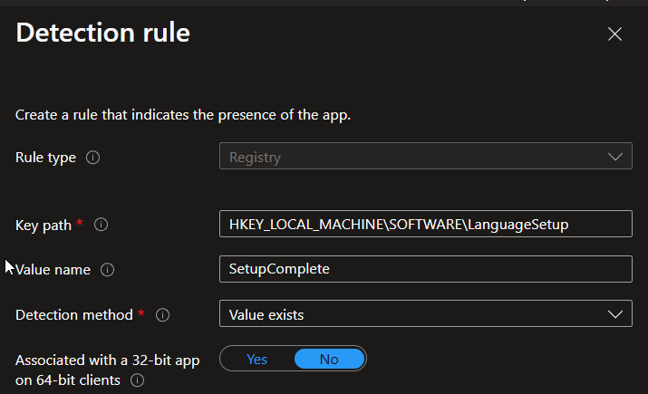

# Windows Language Configuration Package

## Overview
This package provides automated deployment and configuration of Windows language packs and regional settings using the PowerShell App Deployment Toolkit (PSADT). The solution implements a staged approach to ensure reliable language pack installation and configuration across user and system contexts.

## Features
- Automated installation of multiple language packs
- System-level language configuration
- User-level language and keyboard layout setup
- Persistent configuration across system restarts
- Interactive user prompts for important actions
- Comprehensive logging and error handling
- Integration with Microsoft Intune deployment

## Prerequisites
- Windows 10 or later
- PowerShell App Deployment Toolkit (PSADT)
- Administrative privileges
- Microsoft Intune (for deployment)
- Sufficient disk space for language pack installation

## Package Structure
```
Language-Configuration-Package/
├── Deploy-Application.ps1         # Main deployment script
├── AppDeployToolkit/             # PSADT framework files
│   └── AppDeployToolkitMain.ps1
├── Files/                        # Language pack files
└── ServiceUI.exe                 # User interface service
```

## Installation Flow
The package implements a multi-stage installation process:

1. **Initial Stage**
   - Validates system requirements
   - Installs specified language packs (`en-GB`, `en-US`)
   - Creates registry entries for tracking installation progress
   - Sets up system and user configuration scripts
   - Prompts for system restart

2. **System Language Configuration**
   - Runs at system startup via scheduled task
   - Configures system-wide language preferences
   - Creates completion markers
   - Triggers final restart

3. **User Language Setup**
   - Creates desktop shortcut for user language configuration
   - Configures user-specific language and keyboard settings
   - Records completion status

## Deployment via EXE

1. Download ZIP and extract.
2. Run `Deploy-Application.exe` as an administrator.


## Deployment via Intune

### Installation Command
```
.\ServiceUI.exe -process:explorer.exe .\Deploy-Application.exe -DeploymentType 'Install' -DeployMode 'NonInteractive'
```

### Detection Method
Registry Key Path: `HKEY_LOCAL_MACHINE\SOFTWARE\LanguageSetup`



### Intune Configuration
1. Create a new Win32 app in Intune
2. Upload the packaged application (.intunewin file)
3. Configure install command as shown above
4. Set detection rule to check for registry key
5. Configure assignment and deployment settings

## Registry Structure
The package uses the following registry keys:

```
HKEY_LOCAL_MACHINE\SOFTWARE\LanguageSetup
├── InstalledCultures    # Comma-separated list of installed languages
├── PrimaryLanguage      # Primary system language
├── InstallDate         # Installation timestamp
├── SetupStage          # Current installation stage
└── SetupComplete       # Completion timestamp
```

## Logging
Logs are created in multiple locations:
- PSADT logs: `C:\Windows\Logs\Software`
- System language setup: `C:\ProgramData\Microsoft\IntuneScripts`
- User language setup: `C:\ProgramData\Microsoft\IntuneScripts`

## Security Considerations
The package implements several security measures:
- Runs system configuration as SYSTEM account
- Sets appropriate file system permissions
- Implements scheduled task security
- Uses secured registry locations

## Customization
To modify supported languages:
1. Edit the `LanguagesToInstall` array in `Deploy-Application.ps1`
2. Ensure required language packs are available
3. Update detection method if necessary

## Support Files
The following files are created during installation:
- `C:\ProgramData\Microsoft\IntuneScripts\SystemLanguageSetup.ps1`
- `C:\ProgramData\Microsoft\IntuneScripts\UserLanguageSetup.ps1`
- `C:\Users\Public\Desktop\Set Keyboard Language.lnk`

## Limitations
- Requires system restart to complete installation
- Must have sufficient privileges for system configuration
- Language packs must be available in Windows Update or locally

## Version History
- 1.0.0: Initial release
  - Base language pack installation
  - System and user configuration
  - Intune deployment support